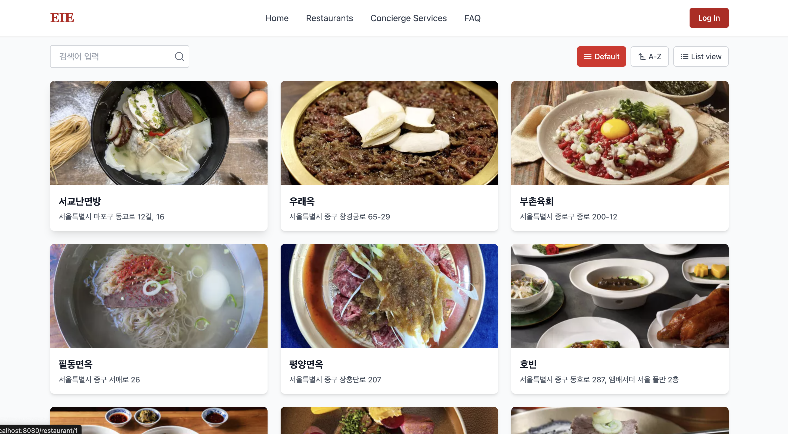
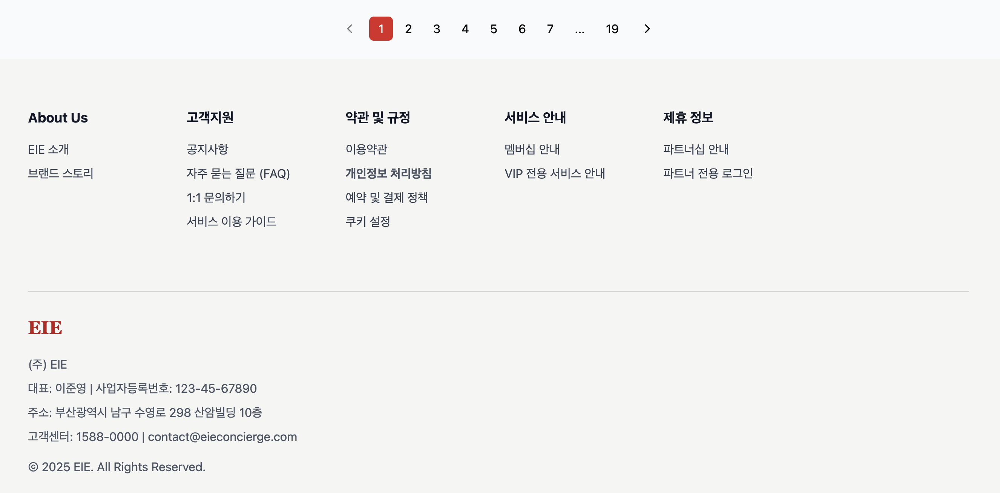
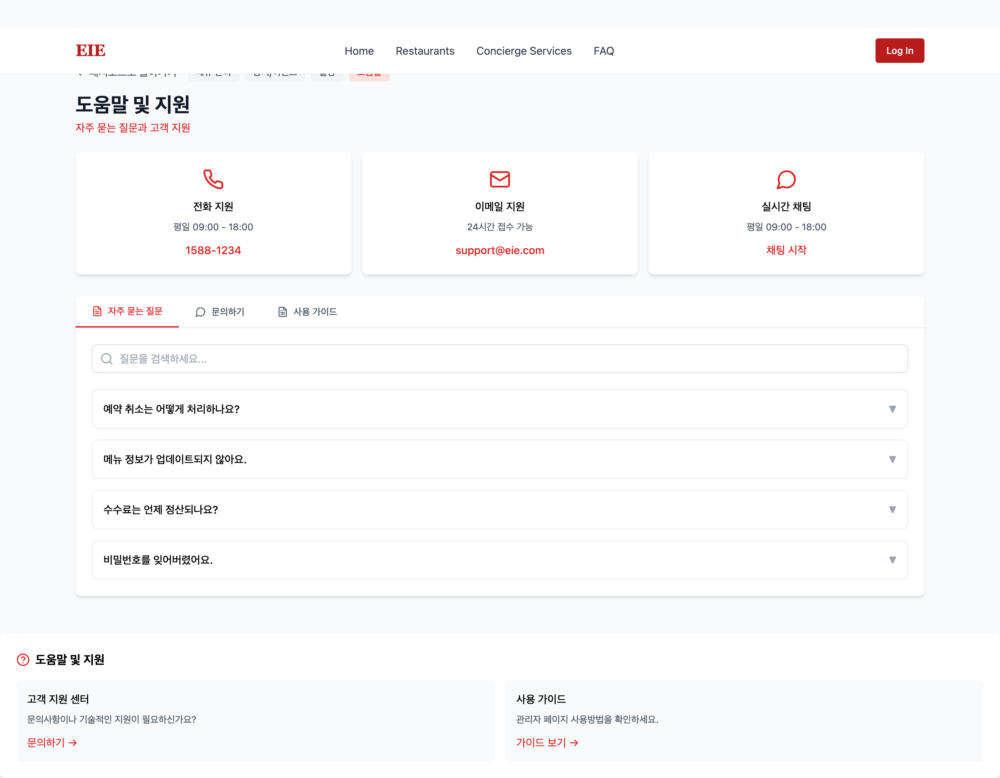
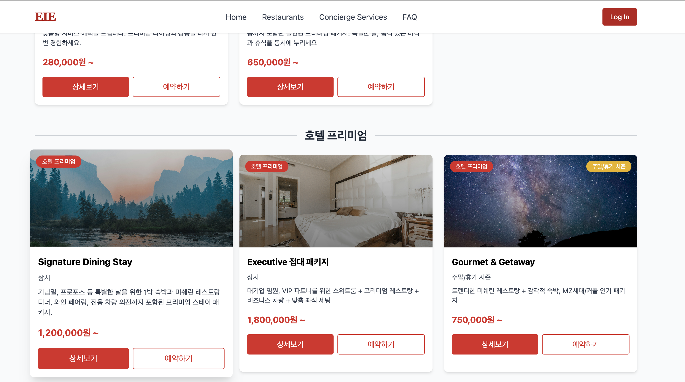
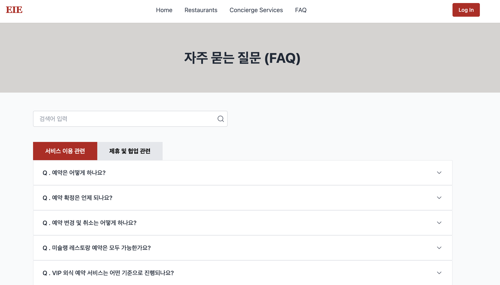
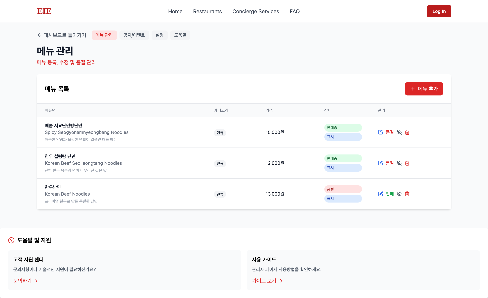
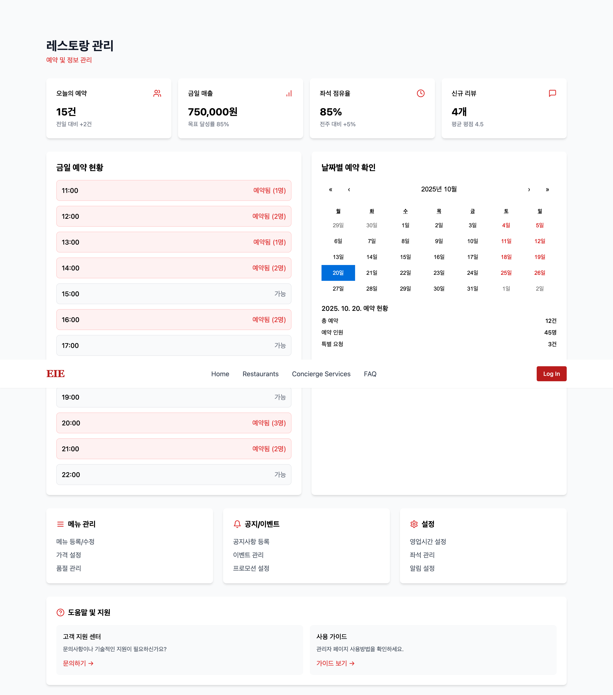
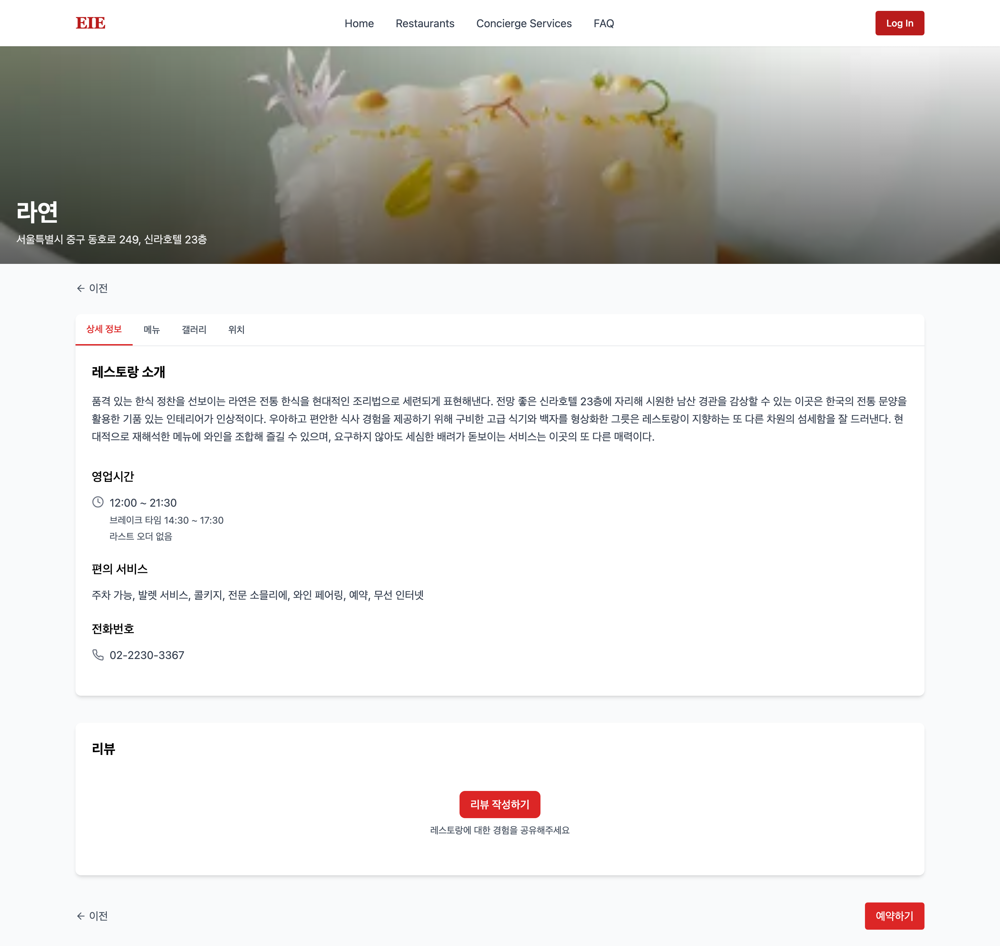
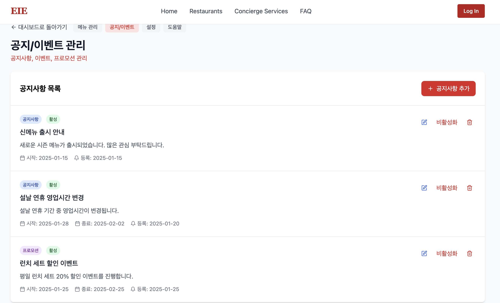
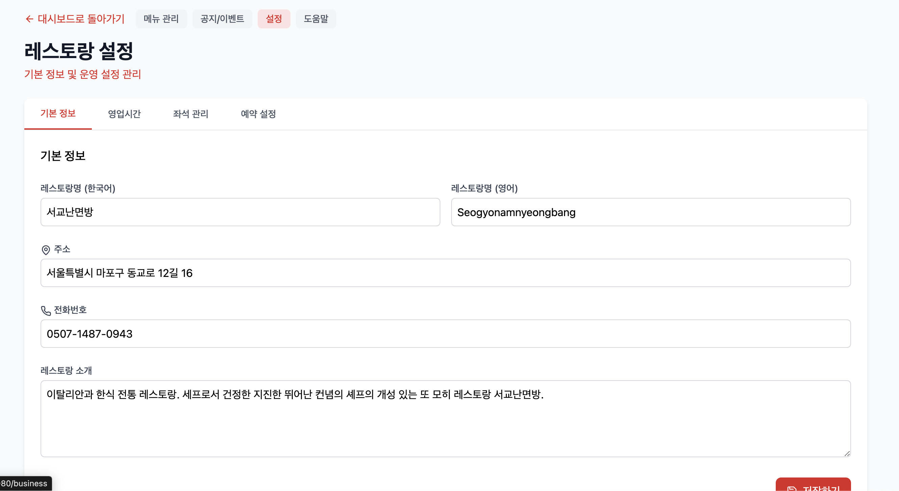

# 🍽️ 미쉐린 예약 플랫폼 2025 Q2

> **B2C + B2B 통합 예약 플랫폼**
> 미쉐린 레스토랑 예약, VIP 컨시어지, 리뷰 시스템을 제공하는 웹 애플리케이션입니다. 실전 운영을 위한
NAS DB, NCP 서버, CI/CD, Docker 등 현대적 인프라 전략을 적용하였습니다.

[](https://nodejs.org/)
[](https://reactjs.org/)
[](https://www.typescriptlang.org/)
[](LICENSE)

## 🏗️ 시스템 아키텍처

```
┌─────────────────────────────────────────────────────────────────────────────────┐
│                              사용자 인터페이스 레이어                              │
├─────────────────────────────────────────────────────────────────────────────────┤
│  📱 모바일 앱(서비스예정)  │  🖥️ 웹 브라우저  │  💼 기업 VIP 포털  │  🔧 관리자 대시보드  │
└─────────────────────────────┬───────────────────────────────────────────────────┘
                              │ HTTPS/SSL
┌─────────────────────────────▼───────────────────────────────────────────────────┐
│                              프론트엔드 레이어                                   │
├─────────────────────────────────────────────────────────────────────────────────┤
│  React 18 + TypeScript + Vite + Tailwind CSS + Naver Map API                    │
│  • 컴포넌트 기반 아키텍처                                                            │
│  • 상태 관리 (Context API)                                                       │
│  • 라우팅 (React Router)                                                         │
│  • API 통신 (Axios)                                                              │
└─────────────────────────────┬───────────────────────────────────────────────────┘
                              │ REST API + WebSocket
┌─────────────────────────────▼───────────────────────────────────────────────────┐
│                              API 게이트웨이 레이어                               │
├─────────────────────────────────────────────────────────────────────────────────┤
│  Nginx (Reverse Proxy) + Load Balancer + SSL Termination                       │
│  • 요청 라우팅 및 로드 밸런싱                                                        │
│  • 정적 파일 서빙                                                                 │
│  • CORS 설정                                                                    │
│  • Rate Limiting                                                               │
└─────────────────────────────┬───────────────────────────────────────────────────┘
                              │ HTTP/WebSocket
┌─────────────────────────────▼───────────────────────────────────────────────────┐
│                              백엔드 API 레이어                                   │
├─────────────────────────────────────────────────────────────────────────────────┤
│  Node.js + Express + TypeScript + Prisma + JWT                                │
│  ┌─────────────────┐  ┌─────────────────┐  ┌─────────────────┐  ┌─────────────────┐ │
│  │   인증/권한 관리   │  │   예약 관리        │  │   레스토랑 관리    │  │   리뷰/평가       │ │
│  │ • JWT 토큰      │  │ • 실시간 예약       │  │ • 정보 CRUD      │  │ • 별점 시스템      │ │
│  │ • 소셜 로그인     │  │ • 알림 시스템       │  │ • 메뉴 관리       │  │ • 사진 업로드      │ │
│  │ • 권한 제어       │  │ • 결제 연동        │  │ • 위치 기반 검색   │  │ • 태그 시스템      │ │
│  └─────────────────┘  └─────────────────┘  └─────────────────┘  └─────────────────┘ │
│  ┌─────────────────┐  ┌─────────────────┐  ┌─────────────────┐  ┌─────────────────┐ │
│  │   VIP 컨시어지    │  │   결제 시스템      │  │   알림 시스템      │  │   통계/분석       │ │
│  │ • 맞춤 서비스     │  │ • 결제 처리        │  │ • 이메일/SMS      │  │ • 대시보드        │ │
│  │ • 일정 관리       │  │ • 환불 처리       │  │ • 푸시 알림        │  │ • 리포트 생성      │ │
│  │ • 전담 지원       │  │ • 결제 검증       │  │ • WebSocket      │  │ • 데이터 시각화    │ │
│  └─────────────────┘  └─────────────────┘  └─────────────────┘  └─────────────────┘ │
└─────────────────────────────┬───────────────────────────────────────────────────┘
                              │ Database Queries
┌─────────────────────────────▼───────────────────────────────────────────────────┐
│                              데이터 레이어                                       │
├─────────────────────────────────────────────────────────────────────────────────┤
│  ┌─────────────────┐  ┌─────────────────┐  ┌─────────────────┐  ┌─────────────────┐ │
│  │   MySQL 8.0     │  │   Redis Cache   │  │   File Storage  │  │   Log Storage   │ │
│  │ • 사용자 데이터    │  │ • 세션 캐시       │  │ • 이미지/파일      │  │ • 애플리케이션 로그  │ │
│  │ • 예약 데이터      │  │ • API 캐시      │  │ • 백업 파일        │  │ • 에러 로그        │ │
│  │ • 레스토랑 데이터   │  │ • 실시간 데이터   │  │ • 문서 파일        │  │ • 성능 로그        │ │
│  │ • 결제 데이터      │  │ • 임시 데이터     │  │ • 미디어 파일      │  │ • 보안 로그        │ │
│  └─────────────────┘  └─────────────────┘  └─────────────────┘  └─────────────────┘ │
└─────────────────────────────┬───────────────────────────────────────────────────┘
                              │ External APIs
┌─────────────────────────────▼───────────────────────────────────────────────────┐
│                              외부 서비스 레이어                                  │
├─────────────────────────────────────────────────────────────────────────────────┤
│  ┌─────────────────┐  ┌─────────────────┐  ┌─────────────────┐  ┌─────────────────┐ │
│  │  네이버 지도 API   │  │  네이버 소셜       │  │  결제 게이트웨이   │  │  이메일 서비스      │ │
│  │ • 위치 검색        │  │ • 로그인 연동      │  │ • 카드 결제      │  │ • SMTP 서버       │ │
│  │ • 경로 안내        │  │ • 사용자 정보      │  │ • 계좌 이체      │  │ • 템플릿 관리       │ │
│  │ • 지도 렌더링      │  │ • 프로필 동기화     │  │ • 결제 검증      │  │ • 발송 추적        │ │
│  └─────────────────┘  └─────────────────┘  └─────────────────┘  └─────────────────┘ │
│  ┌─────────────────┐  ┌─────────────────┐  ┌─────────────────┐  ┌─────────────────┐ │
│  │  SMS 서비스       │  │  푸시 알림        │  │  미쉐린 DB        │  │  모니터링 서비스    │ │
│  │ • 문자 발송       │  │ • FCM/APNS      │  │ • 레스토랑 정보     │  │   • Sentry      │ │
│  │ • 인증 코드       │  │ • 실시간 알림      │  │ • 메뉴 데이터      │  │   • Prometheus  │ │
│  │ • 마케팅 메시지    │  │  • 예약 알림       │  │ • 평점 정보       │  │   • Grafana     │ │
│  └─────────────────┘  └─────────────────┘  └─────────────────┘  └─────────────────┘ │
└─────────────────────────────┬───────────────────────────────────────────────────┘
                              │ Infrastructure
┌─────────────────────────────▼───────────────────────────────────────────────────┐
│                              인프라 레이어                                       │
├─────────────────────────────────────────────────────────────────────────────────┤
│  ┌─────────────────┐  ┌─────────────────┐  ┌─────────────────┐  ┌─────────────────┐ │
│  │  Kubernetes     │  │  Docker         │  │  Helm Charts    │  │  CI/CD Pipeline │ │
│  │ • 컨테이너 오케스트레이션│ • 컨테이너화       │  │ • 배포 자동화      │  │ • GitHub Actions│ │
│  │ • 스케일링        │  │ • 이미지 관리      │  │ • 설정 관리       │  │ • 자동 테스트      │ │
│  │ • 로드 밸런싱      │  │ • 환경 격리       │  │ • 버전 관리       │  │ • 자동 배포       │ │
│  │ • 서비스 디스커버리  │  │ • 포트 관  리     │  │ • 롤백 지원       │  │ • 품질 검사       │ │
│  └─────────────────┘  └─────────────────┘  └─────────────────┘  └─────────────────┘ │
│  ┌─────────────────┐  ┌─────────────────┐  ┌─────────────────┐  ┌─────────────────┐ │
│  │  NCP 클라우드    │  │  모니터링 스택      │  │  로깅 시스템       │  │  보안 시스템       │ │
│  │ • 가상 머신      │  │ • Prometheus    │  │ • ELK Stack      │  │ • WAF           │ │
│  │ • 로드 밸런서     │  │ • Grafana       │  │ • Fluentd       │  │ • SSL/TLS       │ │
│  │ • 오브젝트 스토리지 │  │ • AlertManager  │  │ • Log Rotation  │  │ • 방화벽          │ │
│  │ • CDN           │  │ • Node Exporter │  │ • 로그 분석       │  │ • 접근 제어        │ │
│  └─────────────────┘  └─────────────────┘  └─────────────────┘  └─────────────────┘ │
└─────────────────────────────────────────────────────────────────────────────────┘
```

### 🛠️ 기술 스택 상세

#### **프론트엔드**
- **React 18**: 최신 React 기능 (Concurrent Features, Suspense)
- **TypeScript 5**: 타입 안정성 및 개발 생산성
- **Vite**: 빠른 개발 서버 및 빌드 도구
- **Tailwind CSS**: 유틸리티 기반 CSS 프레임워크
- **React Router**: 클라이언트 사이드 라우팅
- **Axios**: HTTP 클라이언트
- **Recharts**: 데이터 시각화 라이브러리

#### **백엔드**
- **Node.js 18**: 최신 LTS 버전
- **Express.js**: 웹 프레임워크
- **TypeScript**: 서버 사이드 타입 안정성
- **Prisma**: 현대적 ORM
- **JWT**: 인증 토큰
- **WebSocket**: 실시간 통신
- **Swagger**: API 문서화

#### **데이터베이스**
- **MySQL 8.0**: 메인 데이터베이스
- **Redis**: 캐시 및 세션 저장소
- **Prisma**: 타입 안전한 데이터베이스 접근

#### **인프라 & DevOps**
- **Docker**: 컨테이너화
- **Kubernetes**: 오케스트레이션
- **Helm**: 패키지 매니저
- **GitHub Actions**: CI/CD
- **Nginx**: 리버스 프록시
- **PM2**: 프로세스 관리

#### **모니터링 & 로깅**
- **Prometheus**: 메트릭 수집
- **Grafana**: 시각화 대시보드
- **Sentry**: 에러 추적
- **ELK Stack**: 로그 분석

#### **외부 서비스**
- **네이버 지도 API**: 위치 기반 서비스
- **네이버 소셜 로그인**: OAuth 인증
- **결제 게이트웨이**: 결제 처리
- **SMS/이메일 서비스**: 알림 발송

---

## 📸 시연 스크린샷

### 🏠 메인 페이지
미쉐린 레스토랑 검색 및 추천 시스템


### 🍽️ 레스토랑 상세 페이지
레스토랑 정보, 메뉴, 리뷰 및 예약 시스템


### 📋 레스토랑 리스트
필터링 및 검색 기능이 포함된 레스토랑 목록


### 💎 컨시어지 서비스
VIP 고객을 위한 프리미엄 서비스 패키지


### 📅 예약 시스템
실시간 예약 및 특별 요청사항 입력


### 🔐 로그인 시스템
간편 로그인 및 사용자 타입별 접근 제어


### 📊 비즈니스 대시보드
레스토랑 사업자를 위한 통계 및 예약 관리


### 👤 사용자 대시보드
개인 예약 내역 및 프로필 관리


### 📄 푸터 페이지
회사 소개, 약관, FAQ 등 완전한 정보 페이지


### 📱 모바일 반응형
모든 디바이스에서 최적화된 사용자 경험


---

## 🚀 빠른 시작

### 1. 환경 설정
```bash
# 프로젝트 클론
git clone <repository-url>
cd michelin-reservation-platform-2025-Q2

# 환경변수 설정
cp docs/env.example backend/.env
cp docs/env.example frontend/.env
```

### 2. 의존성 설치
```bash
# 백엔드
cd backend && npm install

# 프론트엔드
cd ../frontend && npm install
```

### 3. 서버 실행
```bash
# 개발 환경
cd backend && npm run dev
cd ../frontend && npm run dev

# 운영 (pm2)
pm2 start ecosystem.config.js
pm2 logs
pm2 monit
```

### 4. 접속
- **프론트엔드**: http://localhost:5173
- **백엔드 API**: http://localhost:8000
- **API 문서**: http://localhost:8000/api-docs

---

## 배포
- Docker, CI/CD, 클라우드 환경 지원 예정

## 기여 방법
1. 이슈/PR 등록 후 브랜치 생성
2. 커밋 메시지: feat/fix/docs/chore 등 prefix 사용
3. 코드 리뷰 및 병합

### 기술 스택
- **프론트엔드**: React 18, TypeScript, Vite, Tailwind CSS
- **백엔드**: Node.js, Express, Sequelize, JWT
- **데이터베이스**: MySQL/MariaDB
- **인프라**: Docker, PM2, GitHub Actions
- **모니터링**: Sentry, Prometheus, Grafana

---

## 📁 프로젝트 구조

```
michelin-reservation-platform-2025-Q2/
├── frontend/                 # React 프론트엔드
│   ├── src/
│   │   ├── components/       # 재사용 컴포넌트
│   │   ├── pages/           # 페이지 컴포넌트
│   │   ├── api/             # API 통신
│   │   └── types/           # TypeScript 타입
│   └── package.json
├── backend/                  # Express 백엔드
│   ├── controllers/         # 컨트롤러
│   ├── models/             # 데이터 모델
│   ├── routes/             # API 라우트
│   ├── middleware/         # 미들웨어
│   ├── scripts/            # 자동화 스크립트
│   └── package.json
├── docs/                    # 📚 기술 문서
│   ├── DocsReadme.md       # 문서 가이드
│   ├── system-architecture.md
│   ├── api-specification.md
│   ├── database-design.md
│   └── user-operations-guide.md
├── helm/                    # Kubernetes 배포
├── docker-compose.yml       # Docker 구성
└── README.md               # 이 파일
```

---

## 🛠️ 주요 명령어

### 개발
```bash
npm run dev          # 개발 서버 실행
npm run build        # 프로덕션 빌드
npm test             # 테스트 실행
npm run lint         # 코드 린트
```

### 데이터베이스
```bash
npm run db:migrate   # 마이그레이션 실행
npm run db:seed      # 시드 데이터 삽입
npm run db:reset     # DB 초기화
```

### 운영
```bash
pm2 start ecosystem.config.js    # PM2로 서버 실행
pm2 logs                         # 로그 확인
pm2 monit                        # 모니터링
```

---

## 📚 문서

### 핵심 문서 (5개)
- **[📊 시스템 아키텍처](docs/system-architecture.md)** - 전체 시스템 구조
- **[📋 API 명세서](docs/api-specification.md)** - REST API 상세 명세
- **[🗄️ 데이터베이스 설계서](docs/database-design.md)** - DB 스키마 및 관계
- **[🚀 운영 가이드](docs/user-operations-guide.md)** - 배포 및 운영 매뉴얼
- **[📖 기술 백서](docs/technical-whitepaper.md)** - 기술적 구현 상세

### 참고 문서
- [ERD 다이어그램](docs/erd.md)
- [CI/CD 설정](docs/ci-cd-setup.md)
- [배포 가이드](docs/deployment-guide.md)
- [백업/복구 가이드](docs/backup-restore-guide.md)

---

## 🎯 주요 기능

### 🍽️ 레스토랑 관리
- 미쉐린 레스토랑 정보 조회
- 메뉴 및 가격 정보
- 위치 기반 검색 (네이버 지도 API)

### 📅 예약 시스템
- 실시간 예약 가능 시간 확인
- 예약 생성/수정/취소
- 예약 알림 및 리마인더

### ⭐ 리뷰 시스템
- 사용자 리뷰 작성/조회
- 별점 및 태그 기반 평가
- 사진 업로드 지원

### 💼 VIP 컨시어지
- 기업 VIP 전용 서비스
- 맞춤형 일정 관리
- 전담 컨시어지 지원

### 🔧 관리자 기능
- 레스토랑 정보 관리
- 예약 현황 모니터링
- 사용자 관리 및 통계

---

## 🔧 개발 환경 설정

### 필수 요구사항
- Node.js 18+
- MySQL 8.0+
- Redis (선택사항)

### 환경변수 설정
```bash
# backend/.env
DB_HOST=localhost
DB_PORT=3306
DB_NAME=michelin
DB_USER=your_username
DB_PASSWORD=your_password
JWT_SECRET=your_jwt_secret
```

### 데이터베이스 설정
```bash
# MySQL 접속
mysql -u root -p

# 데이터베이스 생성
CREATE DATABASE michelin CHARACTER SET utf8mb4 COLLATE utf8mb4_unicode_ci;

# 마이그레이션 실행
cd backend && npm run db:migrate
```

---

## 🚀 배포

### Docker 배포
```bash
# 전체 서비스 실행
docker-compose up -d

# 개별 서비스 실행
docker build -t michelin-backend ./backend
docker run -p 8000:8000 michelin-backend
```

### PM2 배포
```bash
# 운영 환경 실행
pm2 start ecosystem.config.js --env production

# 모니터링
pm2 monit
pm2 logs
```

### Kubernetes 배포
```bash
# Helm 차트 배포
helm upgrade --install backend ./helm/backend
helm upgrade --install frontend ./helm/frontend
```

---

## 📊 모니터링

### 로그 확인
```bash
# PM2 로그
pm2 logs

# 파일 로그
tail -f logs/combined.log
tail -f logs/error.log
```

### 메트릭 확인
- **Prometheus**: http://localhost:8000/metrics
- **Grafana**: http://localhost:3000
- **Sentry**: 에러 추적 및 알림

---

## 🤝 기여 방법

1. **이슈 등록**: 버그 리포트 또는 기능 요청
2. **브랜치 생성**: `git checkout -b feature/your-feature`
3. **코드 작성**: 기능 구현 및 테스트
4. **PR 생성**: 코드 리뷰 요청
5. **병합**: 리뷰 승인 후 병합

### 커밋 컨벤션
```
feat: 새로운 기능 추가
fix: 버그 수정
docs: 문서 수정
style: 코드 포맷팅
refactor: 코드 리팩토링
test: 테스트 추가/수정
chore: 빌드 프로세스 또는 보조 도구 변경
```

---

## 📞 문의 및 지원

### 담당자
- **개발팀**: juns [junexi0828@gmail.com]
- **운영팀**: EIEContect@gmail.com
- 기술 지원: juns [junexi0828@gmail.com]
- 운영 지원: pwh[pkwon1216@gmail.com]
- 모니터링: bbk[sigsig256@gmail.com]
- 경영 지원: YJ[molmol1150@naver.com]
- 재무 관련: JH[1212131@naver.com]


### 문서 관련
- 📚 [전체 문서 보기](docs/DocsReadme.md)
- 🐛 [이슈 등록](https://github.com/your-repo/issues)
- 📖 [API 문서](http://localhost:8000/api-docs)

---

## 📄 라이선스

이 프로젝트는 MIT 라이선스 하에 배포됩니다. 자세한 내용은 [LICENSE](LICENSE) 파일을 참조하세요.

---

<div align="center">

**🍽️ 미쉐린 예약 플랫폼으로 특별한 식사 경험을 만들어보세요!**

[시작하기](#-빠른-시작) • [문서 보기](docs/DocsReadme.md) • [이슈 등록](https://github.com/your-repo/issues)

</div>
