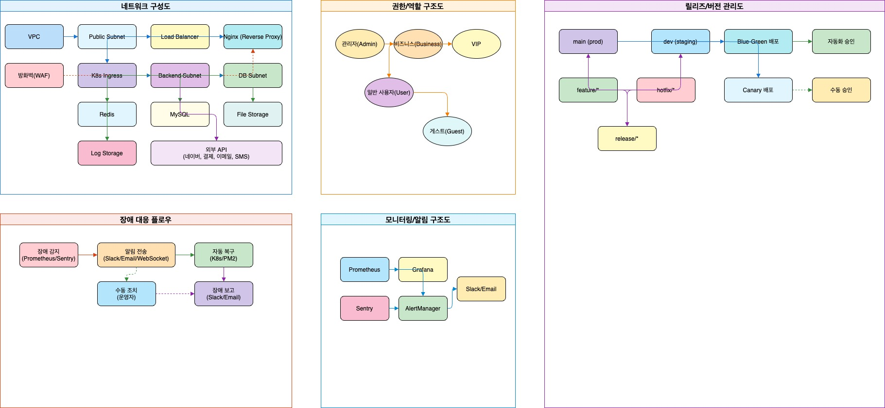
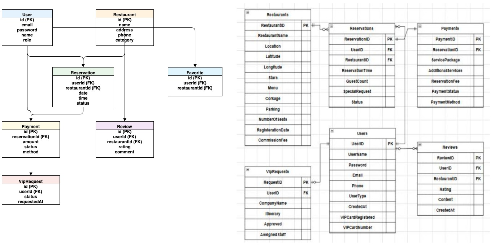
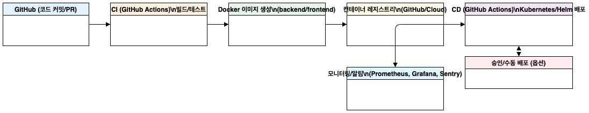
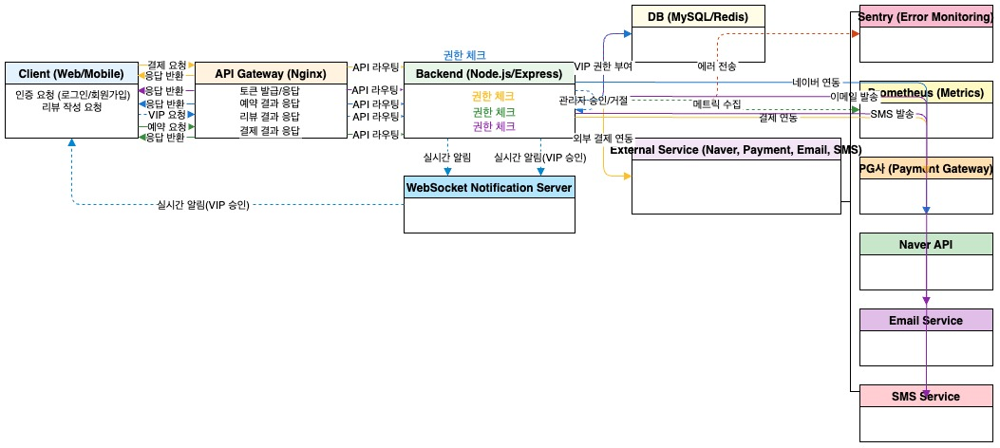

# 📚 미쉐린 예약 플랫폼 기술 문서

## 🎯 문서 개요

이 문서는 미쉐린 예약 플랫폼의 기술적 구현과 운영에 대한 모든 정보를 담고 있습니다.

---

## 📂 문서 분류

### 🔧 **개발자용 문서** (Technical Documents)

#### 핵심 기술 문서
- **[📊 시스템 아키텍처](system-architecture.md)** - 전체 시스템 구조 및 설계
- **[📋 API 명세서](api-specification.md)** - REST API 상세 명세
- **[🗄️ 데이터베이스 설계서](database-design.md)** - DB 스키마 및 관계 설계
- **[📖 기술 백서](technical-whitepaper.md)** - 기술적 구현 상세 설명
- **[⚙️ 운영 스크립트](operations-scripts.md)** - 개발/운영 스크립트 가이드

#### 개발 환경 설정
- **[🔧 CI/CD 설정](ci-cd-setup.md)** - GitHub Actions 파이프라인 구성
- **[🔑 GitHub 토큰 설정](github-token-guide.md)** - GitHub 인증 설정
- **[🚀 GitOps/ArgoCD 가이드](gitops-argocd-guide.md)** - GitOps 배포 방식

#### 데이터베이스 관련
- **[🗄️ ERD 다이어그램](erd.md)** - 간단한 ERD 및 실무 가이드
- **[📊 ERD PDF](ERD.pdf)** - 상세한 ERD 다이어그램

---

### 👥 **사용자용 문서** (User Guides)

#### 운영 가이드
- **[🚀 사용자 운영 가이드](user-operations-guide.md)** - 실무 운영 매뉴얼
- **[⚙️ 환경 구축 가이드](user-setup-guide.md)** - 실무 환경 설정 가이드
- **[📦 배포 가이드](deployment-guide.md)** - 배포 프로세스 가이드
- **[💾 백업/복구 가이드](backup-restore-guide.md)** - 데이터 백업 및 복구

#### 발표 자료
- **[🎤 발표 스크립트](발표스크립트_미쉐린예약플랫폼.md)** - 프로젝트 발표용 스크립트
- **[📊 발표 보조자료](발표보조자료_핵심차트.md)** - 발표용 핵심 차트 및 데이터
- **[❓ 발표 Q&A](발표_Q&A_준비자료.md)** - 발표 예상 질문 및 답변

#### 기획 자료
- **[🎨 UI 화면 구성 기획](UI%20화면%20구성%20기획.docx)** - UI/UX 기획서
- **[📈 플로우차트](플로우차트.drawio%20(1).pdf)** - 시스템 플로우차트

---

## 🎯 문서별 용도

### **투자자/심사자용**
- 📊 시스템 아키텍처
- 📖 기술 백서
- 🎤 발표 스크립트
- 📊 발표 보조자료

### **개발팀용**
- 📋 API 명세서
- 🗄️ 데이터베이스 설계서
- ⚙️ 운영 스크립트
- 🔧 CI/CD 설정

### **운영팀용**
- 🚀 사용자 운영 가이드
- ⚙️ 환경 구축 가이드
- 📦 배포 가이드
- 💾 백업/복구 가이드

### **실무 파트너용**
- 📊 시스템 아키텍처
- 🎨 UI 화면 구성 기획
- 📈 플로우차트
- 🎤 발표 스크립트

---

## 📋 문서 작성 가이드

### **개발자용 문서 작성 원칙**
- ✅ 기술적 정확성 우선
- ✅ 코드 예시 포함
- ✅ 상세한 구현 방법 설명
- ✅ 에러 처리 및 디버깅 가이드

### **사용자용 문서 작성 원칙**
- ✅ 단계별 명확한 설명
- ✅ 스크린샷 및 시각 자료 포함
- ✅ 실무에서 바로 활용 가능한 내용
- ✅ 문제 해결 방법 포함

---

## 🔄 문서 업데이트 정책

### **버전 관리**
- 모든 문서는 Git으로 버전 관리
- 주요 변경사항은 커밋 메시지에 명시
- 문서 변경 시 담당자 리뷰 필수

### **정기 업데이트**
- API 변경 시 API 명세서 즉시 업데이트
- 시스템 변경 시 아키텍처 문서 업데이트
- 운영 프로세스 변경 시 운영 가이드 업데이트

---

## 📞 문서 관련 문의

### **기술적 문의**
- 개발팀 리드: [개발팀 연락처]
- 시스템 아키텍트: [아키텍트 연락처]

### **운영 관련 문의**
- 운영팀 리드: [운영팀 연락처]
- DevOps 엔지니어: [DevOps 연락처]

---

## 📝 문서 작성 체크리스트

### **새 문서 작성 시**
- [ ] 목차 및 구조 명확히 정의
- [ ] 대상 독자 명시
- [ ] 실용적인 예시 포함
- [ ] 검토자 지정 및 리뷰 완료
- [ ] README에 문서 링크 추가

### **기존 문서 업데이트 시**
- [ ] 변경사항 명확히 문서화
- [ ] 버전 정보 업데이트
- [ ] 관련 문서 동기화
- [ ] 팀원 공지 및 교육

---

## 📊 📁 다이어그램 & 시각 자료

### 🎨 **Draw.io 다이어그램 모음**

| 📋 문서명/설명                | 🔗 파일명/경로                                 | 👁️ 미리보기/설명 |
|:----------------------------:|:---------------------------------------------:|:---------------:|
| 🏗️ **시스템 아키텍처**       | `docs/drawio/system-architecture.drawio`      |  |
| 🌐 **인프라/운영 오버뷰**     | `docs/drawio/infra-ops-overview.drawio`       |  |
| 🗄️ **ERD(데이터베이스 설계)** | `docs/drawio/erd.drawio`                      |  |
| 🔄 **CI/CD 파이프라인**       | `docs/drawio/cicd-pipeline.drawio`            |  |
| 🔗 **API 흐름도**             | `docs/drawio/api-flow.drawio`                 |  |

> 💡 **💻 편집 방법**: 각 `.drawio` 파일을 [draw.io](https://app.diagrams.net/)에서 열어서 수정 가능합니다.

---

*마지막 업데이트: 2025년 6월24일*