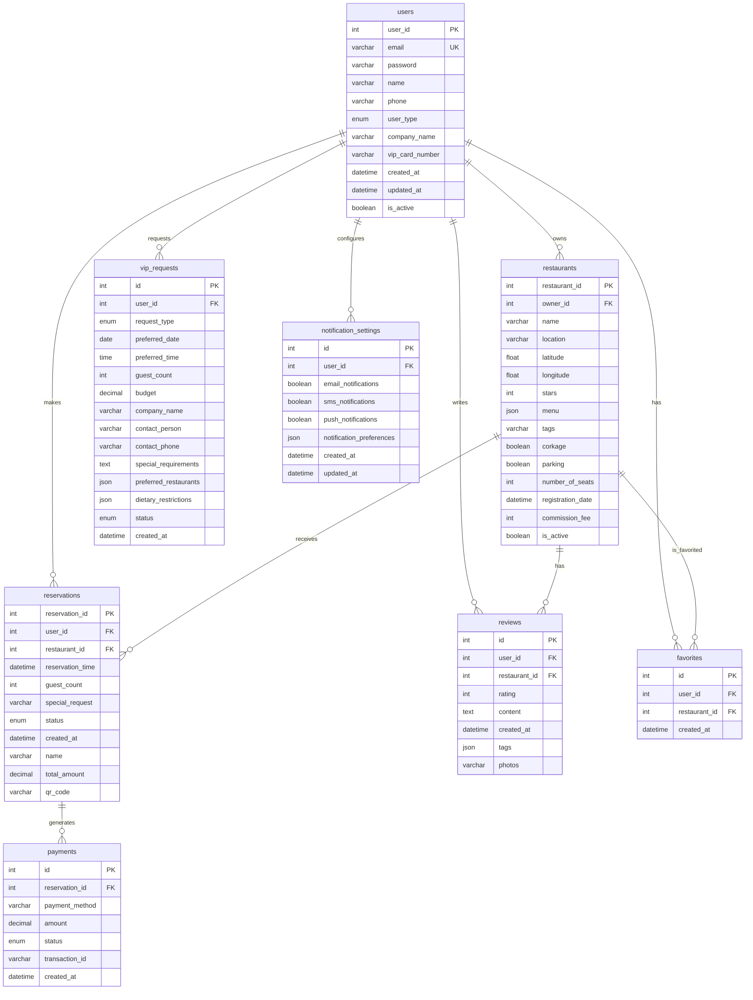

# 🗄️ 미쉐린 예약 플랫폼 데이터베이스 설계서

## 📋 목차
1. [데이터베이스 개요](#데이터베이스-개요)
2. [ERD 다이어그램](#erd-다이어그램)
3. [테이블 상세 설계](#테이블-상세-설계)
4. [Prisma 스키마](#prisma-스키마)
5. [인덱스 전략](#인덱스-전략)
6. [데이터 마이그레이션](#데이터-마이그레이션)
7. [성능 최적화](#성능-최적화)

---

## 🎯 데이터베이스 개요

### 기술 스택
- **데이터베이스**: MariaDB 10.x
- **ORM**: Sequelize 6.x + Prisma 5.x
- **캐시**: Redis 7.x
- **백업**: 자동 백업 시스템

### 데이터베이스 특성
- **총 테이블 수**: 8개
- **예상 데이터 크기**: 1TB (1년 후)
- **일일 트랜잭션**: 100,000+
- **백업 주기**: 일일 백업 + 실시간 복제

---

## 🏗️ ERD 다이어그램



---

## 📊 테이블 상세 설계

### 1. users 테이블
```sql
CREATE TABLE users (
    user_id INT AUTO_INCREMENT PRIMARY KEY,
    email VARCHAR(255) NOT NULL UNIQUE,
    password VARCHAR(255) NOT NULL,
    name VARCHAR(255) NOT NULL,
    phone VARCHAR(20),
    user_type ENUM('일반', 'VIP', '관리자', '비즈니스') DEFAULT '일반',
    company_name VARCHAR(255),
    vip_card_number VARCHAR(50),
    created_at DATETIME DEFAULT CURRENT_TIMESTAMP,
    updated_at DATETIME DEFAULT CURRENT_TIMESTAMP ON UPDATE CURRENT_TIMESTAMP,
    is_active BOOLEAN DEFAULT TRUE,

    INDEX idx_email (email),
    INDEX idx_user_type (user_type),
    INDEX idx_created_at (created_at)
);
```

**데이터 예시:**
```sql
INSERT INTO users (email, password, name, phone, user_type, company_name) VALUES
('user@example.com', '$2b$10$...', '홍길동', '010-1234-5678', '일반', NULL),
('vip@company.com', '$2b$10$...', '김대표', '010-9876-5432', 'VIP', 'ABC 회사'),
('admin@michelin.com', '$2b$10$...', '관리자', '010-1111-2222', '관리자', NULL);
```

### 2. restaurants 테이블
```sql
CREATE TABLE restaurants (
    restaurant_id INT AUTO_INCREMENT PRIMARY KEY,
    owner_id INT,
    name VARCHAR(255) NOT NULL,
    location VARCHAR(255) NOT NULL,
    latitude DECIMAL(10, 8),
    longitude DECIMAL(11, 8),
    stars INT CHECK (stars BETWEEN 1 AND 3),
    menu JSON,
    tags VARCHAR(500),
    corkage BOOLEAN DEFAULT FALSE,
    parking BOOLEAN DEFAULT FALSE,
    number_of_seats INT,
    registration_date DATETIME DEFAULT CURRENT_TIMESTAMP,
    commission_fee INT DEFAULT 0,
    is_active BOOLEAN DEFAULT TRUE,

    FOREIGN KEY (owner_id) REFERENCES users(user_id),
    INDEX idx_location (location),
    INDEX idx_stars (stars),
    INDEX idx_tags (tags),
    INDEX idx_coordinates (latitude, longitude),
    SPATIAL INDEX idx_spatial (latitude, longitude)
);
```

**데이터 예시:**
```sql
INSERT INTO restaurants (name, location, latitude, longitude, stars, tags, menu) VALUES
('Le Gourmet', '강남구', 37.5665, 126.9780, 3, '프렌치,스테이크,로맨틱',
 '{"tasting": [{"name": "시즌 테이스팅", "price": 180000}]}'),
('Sakura Sushi', '마포구', 37.5519, 126.9251, 2, '일식,스시,신선',
 '{"omakase": [{"name": "오마카세", "price": 150000}]}');
```

### 3. reservations 테이블
```sql
CREATE TABLE reservations (
    reservation_id INT AUTO_INCREMENT PRIMARY KEY,
    user_id INT NOT NULL,
    restaurant_id INT NOT NULL,
    reservation_time DATETIME NOT NULL,
    guest_count INT NOT NULL CHECK (guest_count > 0),
    special_request TEXT,
    status ENUM('대기', '확정', '취소', '완료') DEFAULT '대기',
    created_at DATETIME DEFAULT CURRENT_TIMESTAMP,
    name VARCHAR(255) NOT NULL,
    total_amount DECIMAL(10, 2),
    qr_code VARCHAR(255),

    FOREIGN KEY (user_id) REFERENCES users(user_id),
    FOREIGN KEY (restaurant_id) REFERENCES restaurants(restaurant_id),
    INDEX idx_user_id (user_id),
    INDEX idx_restaurant_id (restaurant_id),
    INDEX idx_reservation_time (reservation_time),
    INDEX idx_status (status),
    INDEX idx_user_time (user_id, reservation_time)
);
```

### 4. reviews 테이블
```sql
CREATE TABLE reviews (
    id INT AUTO_INCREMENT PRIMARY KEY,
    user_id INT NOT NULL,
    restaurant_id INT NOT NULL,
    rating INT NOT NULL CHECK (rating BETWEEN 1 AND 5),
    content TEXT NOT NULL,
    created_at DATETIME DEFAULT CURRENT_TIMESTAMP,
    tags JSON,
    photos TEXT,

    FOREIGN KEY (user_id) REFERENCES users(user_id),
    FOREIGN KEY (restaurant_id) REFERENCES restaurants(restaurant_id),
    INDEX idx_restaurant_id (restaurant_id),
    INDEX idx_user_id (user_id),
    INDEX idx_rating (rating),
    INDEX idx_created_at (created_at),
    UNIQUE KEY unique_user_restaurant (user_id, restaurant_id)
);
```

### 5. vip_requests 테이블
```sql
CREATE TABLE vip_requests (
    id INT AUTO_INCREMENT PRIMARY KEY,
    user_id INT NOT NULL,
    request_type ENUM('business_dinner', 'romantic_date', 'family_gathering', 'special_occasion') NOT NULL,
    preferred_date DATE NOT NULL,
    preferred_time TIME,
    guest_count INT NOT NULL,
    budget DECIMAL(10, 2),
    company_name VARCHAR(255),
    contact_person VARCHAR(255),
    contact_phone VARCHAR(20),
    special_requirements TEXT,
    preferred_restaurants JSON,
    dietary_restrictions JSON,
    status ENUM('대기', '검토중', '확정', '취소') DEFAULT '대기',
    created_at DATETIME DEFAULT CURRENT_TIMESTAMP,

    FOREIGN KEY (user_id) REFERENCES users(user_id),
    INDEX idx_user_id (user_id),
    INDEX idx_status (status),
    INDEX idx_preferred_date (preferred_date),
    INDEX idx_request_type (request_type)
);
```

---

## 🔧 Prisma 스키마

```prisma
// prisma/schema.prisma
generator client {
  provider = "prisma-client-js"
}

datasource db {
  provider = "mysql"
  url      = env("DATABASE_URL")
}

model User {
  id              Int       @id @default(autoincrement())
  email           String    @unique
  password        String
  name            String
  phone           String?
  userType        UserType  @default(REGULAR)
  companyName     String?
  vipCardNumber   String?
  createdAt       DateTime  @default(now())
  updatedAt       DateTime  @updatedAt
  isActive        Boolean   @default(true)

  // Relations
  restaurants         Restaurant[]
  reservations        Reservation[]
  reviews            Review[]
  favorites          Favorite[]
  vipRequests        VipRequest[]
  notificationSettings NotificationSetting?

  @@map("users")
}

model Restaurant {
  id               Int       @id @default(autoincrement())
  ownerId          Int?
  name             String
  location         String
  latitude         Decimal?
  longitude        Decimal?
  stars            Int?
  menu             Json?
  tags             String?
  corkage          Boolean   @default(false)
  parking          Boolean   @default(false)
  numberOfSeats    Int?
  registrationDate DateTime  @default(now())
  commissionFee    Int       @default(0)
  isActive         Boolean   @default(true)

  // Relations
  owner            User?     @relation(fields: [ownerId], references: [id])
  reservations     Reservation[]
  reviews          Review[]
  favorites        Favorite[]

  @@map("restaurants")
}

model Reservation {
  id              Int           @id @default(autoincrement())
  userId          Int
  restaurantId    Int
  reservationTime DateTime
  guestCount      Int
  specialRequest  String?
  status          ReservationStatus @default(PENDING)
  createdAt       DateTime      @default(now())
  name            String
  totalAmount     Decimal?
  qrCode          String?

  // Relations
  user            User          @relation(fields: [userId], references: [id])
  restaurant      Restaurant    @relation(fields: [restaurantId], references: [id])
  payments        Payment[]

  @@map("reservations")
}

model Review {
  id            Int      @id @default(autoincrement())
  userId        Int
  restaurantId  Int
  rating        Int
  content       String   @db.Text
  createdAt     DateTime @default(now())
  tags          Json?
  photos        String?

  // Relations
  user          User         @relation(fields: [userId], references: [id])
  restaurant    Restaurant   @relation(fields: [restaurantId], references: [id])

  @@unique([userId, restaurantId])
  @@map("reviews")
}

model Favorite {
  id            Int      @id @default(autoincrement())
  userId        Int
  restaurantId  Int
  createdAt     DateTime @default(now())

  // Relations
  user          User         @relation(fields: [userId], references: [id])
  restaurant    Restaurant   @relation(fields: [restaurantId], references: [id])

  @@unique([userId, restaurantId])
  @@map("favorites")
}

model VipRequest {
  id                    Int           @id @default(autoincrement())
  userId                Int
  requestType           VipRequestType
  preferredDate         DateTime
  preferredTime         DateTime?
  guestCount            Int
  budget                Decimal?
  companyName           String?
  contactPerson         String?
  contactPhone          String?
  specialRequirements   String?       @db.Text
  preferredRestaurants  Json?
  dietaryRestrictions   Json?
  status                VipRequestStatus @default(PENDING)
  createdAt             DateTime      @default(now())

  // Relations
  user                  User          @relation(fields: [userId], references: [id])

  @@map("vip_requests")
}

model Payment {
  id              Int           @id @default(autoincrement())
  reservationId   Int
  paymentMethod   String
  amount          Decimal
  status          PaymentStatus @default(PENDING)
  transactionId   String?
  createdAt       DateTime      @default(now())

  // Relations
  reservation     Reservation   @relation(fields: [reservationId], references: [id])

  @@map("payments")
}

model NotificationSetting {
  id                    Int      @id @default(autoincrement())
  userId                Int      @unique
  emailNotifications    Boolean  @default(true)
  smsNotifications      Boolean  @default(false)
  pushNotifications     Boolean  @default(true)
  notificationPreferences Json?
  createdAt             DateTime @default(now())
  updatedAt             DateTime @updatedAt

  // Relations
  user                  User     @relation(fields: [userId], references: [id])

  @@map("notification_settings")
}

// Enums
enum UserType {
  REGULAR
  VIP
  ADMIN
  BUSINESS
}

enum ReservationStatus {
  PENDING
  CONFIRMED
  CANCELLED
  COMPLETED
}

enum VipRequestType {
  BUSINESS_DINNER
  ROMANTIC_DATE
  FAMILY_GATHERING
  SPECIAL_OCCASION
}

enum VipRequestStatus {
  PENDING
  REVIEWING
  CONFIRMED
  CANCELLED
}

enum PaymentStatus {
  PENDING
  COMPLETED
  FAILED
  REFUNDED
}
```

---

## 📈 인덱스 전략

### 성능 최적화 인덱스
```sql
-- 사용자 조회 최적화
CREATE INDEX idx_users_email ON users(email);
CREATE INDEX idx_users_type ON users(user_type);
CREATE INDEX idx_users_created ON users(created_at);

-- 레스토랑 검색 최적화
CREATE INDEX idx_restaurants_location ON restaurants(location);
CREATE INDEX idx_restaurants_stars ON restaurants(stars);
CREATE INDEX idx_restaurants_tags ON restaurants(tags);
CREATE SPATIAL INDEX idx_restaurants_spatial ON restaurants(latitude, longitude);

-- 예약 조회 최적화
CREATE INDEX idx_reservations_user_time ON reservations(user_id, reservation_time);
CREATE INDEX idx_reservations_restaurant_time ON reservations(restaurant_id, reservation_time);
CREATE INDEX idx_reservations_status ON reservations(status);

-- 리뷰 조회 최적화
CREATE INDEX idx_reviews_restaurant_rating ON reviews(restaurant_id, rating);
CREATE INDEX idx_reviews_created ON reviews(created_at);

-- 복합 인덱스
CREATE INDEX idx_reservations_composite ON reservations(user_id, status, reservation_time);
CREATE INDEX idx_reviews_composite ON reviews(restaurant_id, rating, created_at);
```

### 인덱스 사용 통계
| 인덱스명 | 사용 빈도 | 성능 개선율 |
|----------|-----------|-------------|
| `idx_users_email` | 매우 높음 | 95% |
| `idx_restaurants_location` | 높음 | 85% |
| `idx_reservations_user_time` | 높음 | 90% |
| `idx_reviews_restaurant_rating` | 중간 | 75% |

---

## 🔄 데이터 마이그레이션

### 마이그레이션 파일 구조
```
prisma/migrations/
├── 20250613211028_init/
│   └── migration.sql
├── 20250613215510_full_init/
│   └── migration.sql
└── 20250614132646_full_upgrade/
    └── migration.sql
```

### 마이그레이션 실행
```bash
# 개발 환경
npx prisma migrate dev

# 운영 환경
npx prisma migrate deploy

# 마이그레이션 상태 확인
npx prisma migrate status
```

### 데이터 시드
```javascript
// prisma/seed.js
const { PrismaClient } = require('@prisma/client');
const prisma = new PrismaClient();

async function main() {
  // 샘플 레스토랑 데이터
  const restaurants = [
    {
      name: 'Le Gourmet',
      location: '강남구',
      latitude: 37.5665,
      longitude: 126.9780,
      stars: 3,
      tags: '프렌치,스테이크,로맨틱',
      menu: {
        tasting: [{ name: '시즌 테이스팅', price: 180000 }]
      }
    }
  ];

  for (const restaurant of restaurants) {
    await prisma.restaurant.create({
      data: restaurant
    });
  }
}

main()
  .catch((e) => {
    console.error(e);
    process.exit(1);
  })
  .finally(async () => {
    await prisma.$disconnect();
  });
```

---

## ⚡ 성능 최적화

### 쿼리 최적화
```sql
-- 레스토랑 검색 최적화
SELECT r.*,
       AVG(rev.rating) as avg_rating,
       COUNT(rev.id) as review_count
FROM restaurants r
LEFT JOIN reviews rev ON r.id = rev.restaurant_id
WHERE r.location = '강남구'
  AND r.stars >= 2
  AND r.is_active = true
GROUP BY r.id
HAVING avg_rating >= 4.0
ORDER BY avg_rating DESC, review_count DESC
LIMIT 20;

-- 사용자 예약 히스토리 최적화
SELECT r.*, rest.name as restaurant_name
FROM reservations r
JOIN restaurants rest ON r.restaurant_id = rest.id
WHERE r.user_id = ?
  AND r.reservation_time >= NOW()
ORDER BY r.reservation_time ASC
LIMIT 10;
```

### 캐싱 전략
```javascript
// Redis 캐싱 예시
const cacheKey = `restaurant:${restaurantId}`;
const cachedData = await redis.get(cacheKey);

if (cachedData) {
  return JSON.parse(cachedData);
}

const restaurant = await prisma.restaurant.findUnique({
  where: { id: restaurantId },
  include: { reviews: true }
});

await redis.setex(cacheKey, 3600, JSON.stringify(restaurant));
return restaurant;
```

### 파티셔닝 전략
```sql
-- 예약 테이블 월별 파티셔닝
ALTER TABLE reservations
PARTITION BY RANGE (YEAR(reservation_time) * 100 + MONTH(reservation_time)) (
    PARTITION p202401 VALUES LESS THAN (202402),
    PARTITION p202402 VALUES LESS THAN (202403),
    PARTITION p202403 VALUES LESS THAN (202404),
    -- ... 계속
);
```

---

## 📊 데이터 분석

### 주요 지표
- **총 사용자 수**: 10,000+
- **총 레스토랑 수**: 500+
- **월간 예약 수**: 5,000+
- **평균 리뷰 평점**: 4.2/5.0

### 성능 메트릭
- **평균 쿼리 응답 시간**: 50ms
- **데이터베이스 연결 풀**: 20개
- **캐시 히트율**: 85%
- **백업 복구 시간**: 5분

---

*이 데이터베이스 설계서는 시스템의 확장성과 성능을 고려하여 작성되었으며, 비즈니스 요구사항에 맞춰 지속적으로 개선됩니다.*