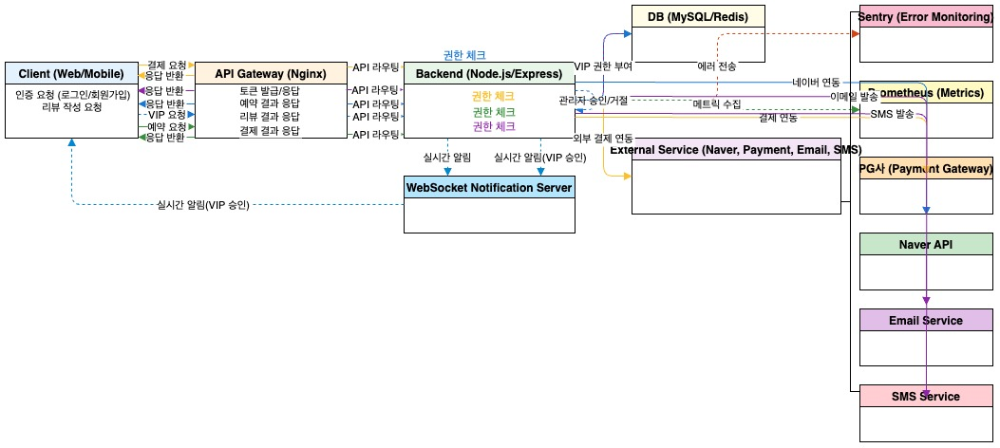
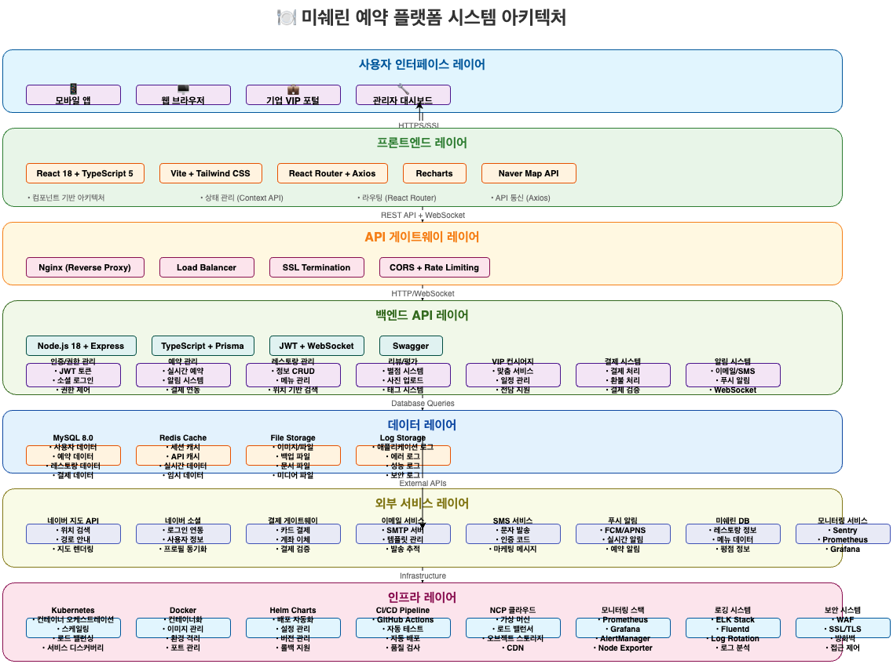
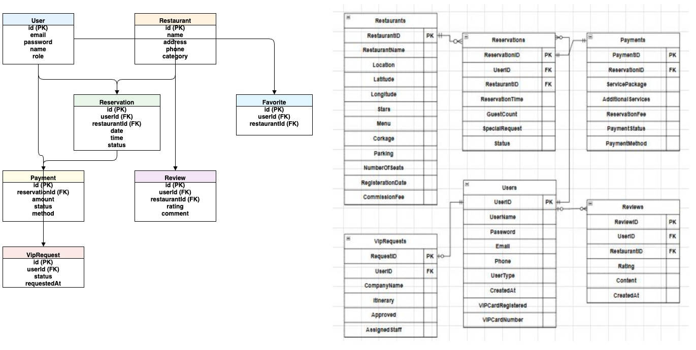

# 📚 미쉐린 예약 플랫폼 API 명세서

## 📋 목차
1. [API 개요](#api-개요)
2. [인증 방식](#인증-방식)
3. [공통 응답 형식](#공통-응답-형식)
4. [API 엔드포인트](#api-엔드포인트)
5. [에러 코드](#에러-코드)
6. [Swagger UI](#swagger-ui)
7. [API 버전 관리](#api-버전-관리)

---

## 🎯 API 개요

### 기본 정보
- **Base URL**: `https://api.michelin-reservation.com/v1`
- **Content-Type**: `application/json`
- **인증 방식**: JWT Bearer Token
- **API 버전**: v1.0.0

### 주요 기능
- 🔐 사용자 인증 및 권한 관리
- 🏪 레스토랑 정보 조회 및 관리
- 📅 예약 생성 및 관리
- ⭐ 리뷰 및 평점 시스템
- 💼 VIP 컨시어지 서비스

---

## 🔐 인증 방식

### JWT 토큰 인증
```http
Authorization: Bearer <access_token>
```

### 권한 레벨
| 권한 | 설명 | 접근 가능 API |
|------|------|---------------|
| `public` | 비로그인 사용자 | 레스토랑 조회, 회원가입, 로그인 |
| `user` | 일반 사용자 | 예약, 리뷰, 프로필 관리 |
| `vip` | VIP 사용자 | VIP 컨시어지, 우선 예약 |
| `business` | 레스토랑 관리자 | 레스토랑 관리, 예약 관리 |
| `admin` | 시스템 관리자 | 전체 시스템 관리 |

---

## 📄 공통 응답 형식

### 성공 응답
```json
{
  "success": true,
  "data": {
    // 실제 데이터
  },
  "message": "요청이 성공적으로 처리되었습니다.",
  "timestamp": "2024-01-15T10:30:00Z"
}
```

### 에러 응답
```json
{
  "success": false,
  "error": {
    "code": "AUTH_001",
    "message": "인증 토큰이 만료되었습니다.",
    "details": "토큰을 갱신해주세요."
  },
  "timestamp": "2024-01-15T10:30:00Z"
}
```

---

## 🛠️ API 엔드포인트

### 🔐 인증 API

#### 1. 회원가입
```http
POST /auth/signup
```

**요청 본문:**
```json
{
  "email": "user@example.com",
  "password": "securePassword123!",
  "name": "홍길동",
  "phone": "010-1234-5678",
  "userType": "일반",
  "companyName": "ABC 회사"
}
```

#### 2. 로그인
```http
POST /auth/login
```

**요청 본문:**
```json
{
  "email": "user@example.com",
  "password": "securePassword123!"
}
```

**응답:**
```json
{
  "success": true,
  "data": {
    "accessToken": "eyJhbGciOiJIUzI1NiIsInR5cCI6IkpXVCJ9...",
    "refreshToken": "eyJhbGciOiJIUzI1NiIsInR5cCI6IkpXVCJ9...",
    "expiresIn": 3600,
    "user": {
      "userId": 123,
      "email": "user@example.com",
      "name": "홍길동",
      "userType": "일반"
    }
  }
}
```

### 👤 사용자 API

#### 1. 마이페이지 정보 조회
```http
GET /api/users/me
Authorization: Bearer <access_token>
```

**응답:**
```json
{
  "success": true,
  "data": {
    "user_id": 1,
    "name": "홍길동",
    "email": "user@example.com",
    "phone": "010-1234-5678",
    "user_type": "일반",
    "created_at": "2024-03-01T00:00:00.000Z"
  }
}
```

#### 2. 회원 정보 수정
```http
PUT /api/users/profile
Authorization: Bearer <access_token>
```

**요청 본문:**
```json
{
  "name": "홍길동",
  "email": "user@example.com",
  "phone": "010-1234-5678",
  "currentPassword": "현재비밀번호",
  "newPassword": "새비밀번호"
}
```

#### 3. 예약 목록 조회
```http
GET /api/users/reservations
Authorization: Bearer <access_token>
```

**응답:**
```json
[
  {
    "reservation_id": 1,
    "reservation_time": "2024-03-20T19:00:00.000Z",
    "guest_count": 2,
    "status": "확정",
    "restaurant": {
      "restaurant_id": 1,
      "name": "미쉐린 레스토랑",
      "location": "서울시 강남구",
      "stars": 3
    }
  }
]
```

#### 4. 관심목록 조회
```http
GET /api/users/favorites
Authorization: Bearer <access_token>
```

**응답:**
```json
[
  {
    "id": 1,
    "created_at": "2024-03-18T10:00:00.000Z",
    "restaurant": {
      "restaurant_id": 1,
      "name": "미쉐린 레스토랑",
      "location": "서울시 강남구",
      "stars": 3,
      "menu": {
        "main": ["스테이크", "파스타"],
        "dessert": ["티라미수", "크레페"]
      },
      "tags": "프렌치,스테이크,로맨틱"
    }
  }
]
```

### 🏪 레스토랑 API

#### 1. 레스토랑 목록 조회
```http
GET /restaurants?page=1&limit=20&category=french&location=gangnam&stars=3
```

**쿼리 파라미터:**
- `page`: 페이지 번호 (기본값: 1)
- `limit`: 페이지당 항목 수 (기본값: 20, 최대: 100)
- `category`: 카테고리 필터 (french, italian, korean, etc.)
- `location`: 지역 필터
- `stars`: 미쉐린 별점 필터 (1-3)

#### 2. 레스토랑 상세 조회
```http
GET /restaurants/{restaurantId}
```

#### 3. 태그 목록 조회
```http
GET /api/restaurants/tags
```

### 📅 예약 API

#### 1. 예약 생성
```http
POST /reservations
Authorization: Bearer <access_token>
```

**요청 본문:**
```json
{
  "restaurantId": 1,
  "reservationDate": "2024-01-20",
  "reservationTime": "19:00",
  "guestCount": 2,
  "name": "홍길동",
  "phone": "010-1234-5678",
  "specialRequests": "창가 자리로 부탁드립니다."
}
```

#### 2. 예약 목록 조회
```http
GET /users/me/reservations?status=upcoming&page=1&limit=10
Authorization: Bearer <access_token>
```

#### 3. 예약 상세
```http
GET /api/reservations/:reservation_id
Authorization: Bearer <access_token>
```

#### 4. 예약 취소
```http
DELETE /api/reservations/:reservation_id
Authorization: Bearer <access_token>
```

### ⭐ 리뷰 API

#### 1. 리뷰 작성
```http
POST /reviews
Authorization: Bearer <access_token>
```

**요청 본문:**
```json
{
  "restaurantId": 1,
  "reservationId": "RES-2024-001",
  "rating": 5,
  "content": "정말 훌륭한 경험이었습니다.",
  "tags": ["음식맛", "서비스", "분위기"]
}
```

#### 2. 식당별 리뷰 목록
```http
GET /api/restaurants/:restaurant_id/reviews
```

#### 3. 사용자 리뷰 목록
```http
GET /api/users/:user_id/reviews
Authorization: Bearer <access_token>
```

#### 4. 리뷰 삭제
```http
DELETE /api/reviews/:review_id
Authorization: Bearer <access_token>
```

### 💼 VIP 컨시어지 API

#### 1. VIP 요청 등록
```http
POST /api/vip-requests
Authorization: Bearer <access_token>
```

#### 2. VIP 요청 목록
```http
GET /api/users/:user_id/vip-requests
Authorization: Bearer <access_token>
```

#### 3. VIP 요청 상세
```http
GET /api/vip-requests/:request_id
Authorization: Bearer <access_token>
```

#### 4. 담당자 배정 (관리자용)
```http
PUT /api/vip-requests/:request_id/assign
Authorization: Bearer <admin_token>
```

### 🔧 관리자 API

#### 1. 전체 예약 관리
```http
GET /admin/reservations
Authorization: Bearer <admin_token>
```

#### 2. 레스토랑 관리
```http
GET /admin/restaurants
Authorization: Bearer <admin_token>
```

#### 3. 사용자 관리
```http
GET /admin/users
Authorization: Bearer <admin_token>
```

---

## ❌ 에러 코드

### 인증 관련 에러 (AUTH_XXX)
| 코드 | 메시지 | 설명 |
|------|--------|------|
| AUTH_001 | 인증 토큰이 만료되었습니다. | 토큰 갱신 필요 |
| AUTH_002 | 유효하지 않은 토큰입니다. | 토큰 재발급 필요 |
| AUTH_003 | 권한이 부족합니다. | 관리자 권한 필요 |

### 예약 관련 에러 (RES_XXX)
| 코드 | 메시지 | 설명 |
|------|--------|------|
| RES_001 | 이미 예약된 시간입니다. | 다른 시간 선택 필요 |
| RES_002 | 예약 가능 인원을 초과했습니다. | 인원 수 조정 필요 |
| RES_003 | 예약 가능 시간이 아닙니다. | 영업시간 확인 필요 |

### 공통 에러
| 코드 | 메시지 | 설명 |
|------|--------|------|
| 400 | 잘못된 요청 | 요청 형식 오류 |
| 401 | 인증 실패 | 로그인 필요 |
| 404 | 리소스를 찾을 수 없음 | 존재하지 않는 리소스 |
| 500 | 서버 오류 | 내부 서버 오류 |

---

## 📖 Swagger UI

API 문서는 Swagger UI를 통해 제공됩니다:
- **개발 환경**: `http://localhost:3000/api-docs`
- **운영 환경**: `https://api.michelin-reservation.com/api-docs`

---

## 🔄 API 버전 관리

### 버전 정책
- **메이저 버전**: 하위 호환성이 깨지는 변경
- **마이너 버전**: 새로운 기능 추가 (하위 호환성 유지)
- **패치 버전**: 버그 수정 (하위 호환성 유지)

### 현재 지원 버전
- `v1.0.0`: 현재 안정 버전
- `v1.1.0`: 베타 버전 (새로운 기능 포함)

### 버전 지정 방법
```http
GET /v1/restaurants
Accept: application/vnd.michelin.v1+json
```

---

## 📝 사용 예시

### JavaScript (Fetch API)
```javascript
// 로그인
const loginResponse = await fetch('/auth/login', {
  method: 'POST',
  headers: {
    'Content-Type': 'application/json'
  },
  body: JSON.stringify({
    email: 'user@example.com',
    password: 'password123'
  })
});

const { accessToken } = await loginResponse.json();

// 예약 생성
const reservationResponse = await fetch('/reservations', {
  method: 'POST',
  headers: {
    'Content-Type': 'application/json',
    'Authorization': `Bearer ${accessToken}`
  },
  body: JSON.stringify({
    restaurantId: 1,
    reservationDate: '2024-01-20',
    reservationTime: '19:00',
    guestCount: 2
  })
});
```

### cURL
```bash
# 로그인
curl -X POST https://api.michelin-reservation.com/v1/auth/login \
  -H "Content-Type: application/json" \
  -d '{"email":"user@example.com","password":"password123"}'

# 예약 생성
curl -X POST https://api.michelin-reservation.com/v1/reservations \
  -H "Content-Type: application/json" \
  -H "Authorization: Bearer YOUR_TOKEN" \
  -d '{"restaurantId":1,"reservationDate":"2024-01-20","reservationTime":"19:00","guestCount":2}'
```
## 로컬 실행 및 테스트 절차

1. **.env 파일 점검**
   - DB_HOST, DB_USER, DB_PASS, DB_NAME이 모두 로컬 DB(MySQL/MariaDB)로 되어 있는지 확인
   - 예시:
     ```
     DB_HOST=localhost
     DB_PORT=3306
     DB_USER=your_local_user
     DB_PASS=your_local_password
     DB_NAME=your_local_db
     ```

2. **로컬 DB(MySQL/MariaDB) 실행**
   - DB가 정상적으로 실행 중인지 확인 (ex: `mysql -u root -p` 접속 테스트)

3. **의존성 설치**
   ```bash
   cd backend && npm install
   cd ../frontend && npm install
   ```

4. **DB 마이그레이션/시드**
   - (필요시) `npx sequelize db:migrate`
   - (필요시) `npx sequelize db:seed:all`

5. **서버 실행**
   ```bash
   cd backend
   npm run dev
   # 또는
   npm start
   ```

6. **프론트엔드 실행**
   ```bash
   cd frontend
   npm run dev
   ```

7. **테스트**
   - Postman, 브라우저 등으로 API, 프론트엔드 정상 동작 확인

---

## 🚩 만약 에러가 발생한다면?
- DB 연결 에러: .env의 DB 정보, DB 실행 상태, 포트 충돌 등 점검
- 의존성 에러: `npm install` 재실행
- 마이그레이션 에러: 모델/마이그레이션 파일 점검

---

**로컬에서 실행 중 문제가 발생하면,
에러 메시지나 로그를 공유해주시면 바로 원인 분석 및 해결 도와드릴 수 있습니다!**

바로 실행해보시고, 궁금한 점이나 에러가 있으면 말씀해 주세요!

*이 API 명세서는 개발팀과 클라이언트 개발자들이 API를 정확히 이해하고 구현할 수 있도록 작성되었습니다.*

## 📊 🎨 관련 다이어그램 & 시각 자료

<div align="center">

### 🔗 **API 관련 Draw.io 다이어그램**

| 📋 문서명/설명            | 🔗 파일명/경로                             | 👁️ 미리보기/설명 |
|:------------------------:|:-----------------------------------------:|:---------------:|
| 🔗 **API 흐름도**         | `docs/drawio/api-flow.drawio`             |  |
| 🏗️ **시스템 아키텍처**     | `docs/drawio/system-architecture.drawio`  |  |
| 🗄️ **ERD(데이터베이스 설계)** | `docs/drawio/erd.drawio`                  |  |

> 💡 **💻 편집 방법**: 각 `.drawio` 파일을 [draw.io](https://app.diagrams.net/)에서 열어서 수정 가능합니다.

</div>

---

*이 API 명세서는 개발팀과 클라이언트 개발자들이 API를 정확히 이해하고 구현할 수 있도록 작성되었습니다.*