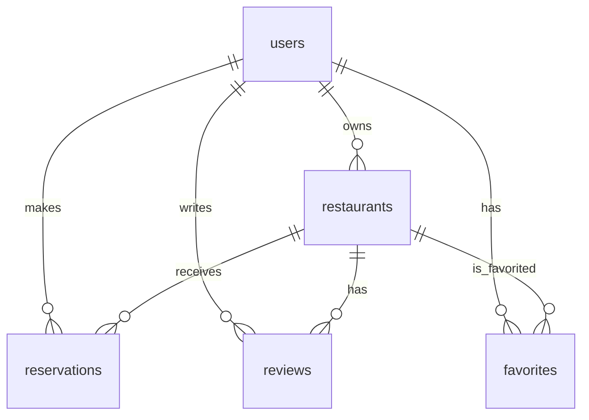

# Michelin Reservation Platform ERD

## 테이블 구조

### users
- `user_id` (PK): INTEGER, AUTO_INCREMENT
- `email`: VARCHAR(255), NOT NULL, UNIQUE
- `password`: VARCHAR(255), NOT NULL
- `name`: VARCHAR(255), NOT NULL
- `phone`: VARCHAR(255)
- `user_type`: ENUM('일반', 'VIP', '관리자'), DEFAULT '일반'
- `company_name`: VARCHAR(255)
- `vip_card_number`: VARCHAR(255)
- `created_at`: DATETIME, DEFAULT CURRENT_TIMESTAMP

### restaurants
- `restaurant_id` (PK): INTEGER, AUTO_INCREMENT
- `owner_id` (FK): INTEGER, REFERENCES users(user_id)
- `name`: VARCHAR(255), NOT NULL
- `location`: VARCHAR(255), NOT NULL
- `latitude`: FLOAT
- `longitude`: FLOAT
- `stars`: INTEGER
- `menu`: JSON
- `tags`: VARCHAR(255)
- `corkage`: BOOLEAN
- `parking`: BOOLEAN
- `number_of_seats`: INTEGER
- `registration_date`: DATETIME, DEFAULT CURRENT_TIMESTAMP
- `commission_fee`: INTEGER

### reservations
- `reservation_id` (PK): INTEGER, AUTO_INCREMENT
- `user_id` (FK): INTEGER, NOT NULL, REFERENCES users(user_id)
- `restaurant_id` (FK): INTEGER, NOT NULL, REFERENCES restaurants(restaurant_id)
- `reservation_time`: DATETIME, NOT NULL
- `guest_count`: INTEGER, NOT NULL
- `special_request`: VARCHAR(255)
- `status`: ENUM('대기', '확정', '취소'), DEFAULT '대기'
- `created_at`: DATETIME, DEFAULT CURRENT_TIMESTAMP
- `name`: VARCHAR(255), NOT NULL

### reviews
- `id` (PK): INTEGER, AUTO_INCREMENT
- `user_id` (FK): INTEGER, NOT NULL, REFERENCES users(user_id)
- `restaurant_id` (FK): INTEGER, NOT NULL, REFERENCES restaurants(restaurant_id)
- `rating`: INTEGER, NOT NULL
- `content`: TEXT, NOT NULL
- `created_at`: DATETIME, DEFAULT CURRENT_TIMESTAMP

### favorites
- `id` (PK): INTEGER, AUTO_INCREMENT
- `user_id` (FK): INTEGER, NOT NULL, REFERENCES users(user_id)
- `restaurant_id` (FK): INTEGER, NOT NULL, REFERENCES restaurants(restaurant_id)
- `created_at`: DATETIME, DEFAULT CURRENT_TIMESTAMP

## 관계도



## 관계 설명

1. **users - restaurants**
   - 한 사용자는 여러 레스토랑을 소유할 수 있음 (1:N)
   - 레스토랑은 한 명의 소유자를 가짐 (N:1)

2. **users - reservations**
   - 한 사용자는 여러 예약을 할 수 있음 (1:N)
   - 예약은 한 명의 사용자에 속함 (N:1)

3. **users - reviews**
   - 한 사용자는 여러 리뷰를 작성할 수 있음 (1:N)
   - 리뷰는 한 명의 사용자에 속함 (N:1)

4. **users - favorites**
   - 한 사용자는 여러 레스토랑을 관심목록에 추가할 수 있음 (1:N)
   - 관심목록은 한 명의 사용자에 속함 (N:1)

5. **restaurants - reservations**
   - 한 레스토랑은 여러 예약을 받을 수 있음 (1:N)
   - 예약은 한 레스토랑에 속함 (N:1)

6. **restaurants - reviews**
   - 한 레스토랑은 여러 리뷰를 가질 수 있음 (1:N)
   - 리뷰는 한 레스토랑에 속함 (N:1)

7. **restaurants - favorites**
   - 한 레스토랑은 여러 사용자의 관심목록에 추가될 수 있음 (1:N)
   - 관심목록은 한 레스토랑에 속함 (N:1)

---

## 4. 플로우차트


---

> 실제 DB/모델/마이그레이션은 이 ERD와 100% 동기화하여 관리합니다.

PORT=8001
DB_HOST=localhost
DB_PORT=3306
DB_NAME=michelin_db
DB_USER=michelin_user
DB_PASS=yourpassword
JWT_SECRET=your_super_secret 

# Michelin Reservation Platform - 개발/운영 전략 (최종)

---

## 전체 구성 전략 개요 

## 1. 주요 구성요소 및 플랫폼

| 역할         | 사용 기술/서비스                | 설명                                      |
| ------------ | ------------------------------ | ----------------------------------------- |
| 개발환경     | 로컬 (Mac/Win)                 | 전체 코드 개발 (React + Express + MariaDB)|
| 코드저장소   | GitHub                         | CI/CD 트리거, 형상 관리                   |
| DB 서버      | Synology DS223j (MariaDB)      | 24시간 가동 DB (로컬/외부 포트포워딩)     |
| 웹서버/API   | NCP Ubuntu VM                  | 프론트+백엔드 Docker로 구동               |
| 정적파일     | NAS/NCP Object Storage         | 이미지, 첨부파일 등 저장소                |

---

## 2. 도메인/네트워크 전략

| 항목             | 설명                                         | 비고                        |
| ---------------- | -------------------------------------------- | --------------------------- |
| 도메인 구매 여부 | 선택 사항                                    | 실 서비스 시 구매           |
| 서브도메인 구성  | api.도메인.com, www.도메인.com               | nginx 리버스 프록시         |
| 공인 IP          | NCP 서버에서 제공                             | 도메인 연결/포트포워딩      |
| NAS 접속         | 내부: 로컬IP / 외부: DDNS/공인IP+포트         | 예: jun.synology.me:3307    |

---

## 3. 디렉토리 및 구성 구조

```
project-root/
├── frontend/        # React 프로젝트
├── backend/         # Express API 서버
├── database/        # Sequelize 모델 + 마이그레이션
├── deploy/          # Docker, nginx, CI/CD 관련 파일
└── docs/            # ERD, API 명세, 회의록, 전략 정리
```

---

## 4. 단계별 구현 순서

1. **로컬 개발**: 프론트(5173), 백엔드(8001), MariaDB(로컬/NAS)
2. **NAS DB 구성**: MariaDB 설치, 포트포워딩, DDNS 등
3. **.env 설정**: 환경별 분리 관리
4. **NCP 서버 준비**: Ubuntu VM, Docker/nginx, GitHub Actions
5. **CI/CD 구성**: 자동 빌드/배포, NAS DB 연결

---

## 5. 보안 및 운영 전략

| 항목         | 설명                                         |
| ------------ | -------------------------------------------- |
| NCP 서버     | SSH만 허용, root 제한                        |
| NAS          | DB 포트 외부 제한/IP 화이트리스트            |
| .env         | git 미포함, 서버에 수동 배치/Secrets 사용    |
| SSL(선택)    | Let's Encrypt + nginx 무료 HTTPS             |

---

## 6. 비용/운영 전략

| 항목           | 고려 포인트                                 |
| -------------- | ------------------------------------------- |
| DB             | NAS 운영 시 무료, NCP DB는 과금             |
| 서버           | 무료 크레딧 후 트래픽 기준 과금             |
| Object Storage | 업/다운로드 트래픽 기준 과금                |
| 도메인         | 연 1~2만원(선택)                            |

---

## 7. 기타

- 모든 전략/구성/운영 내역은 docs/에 최신화하여 관리
- BEP 분석, 확장/마이그레이션 전략 등도 추가 예정 