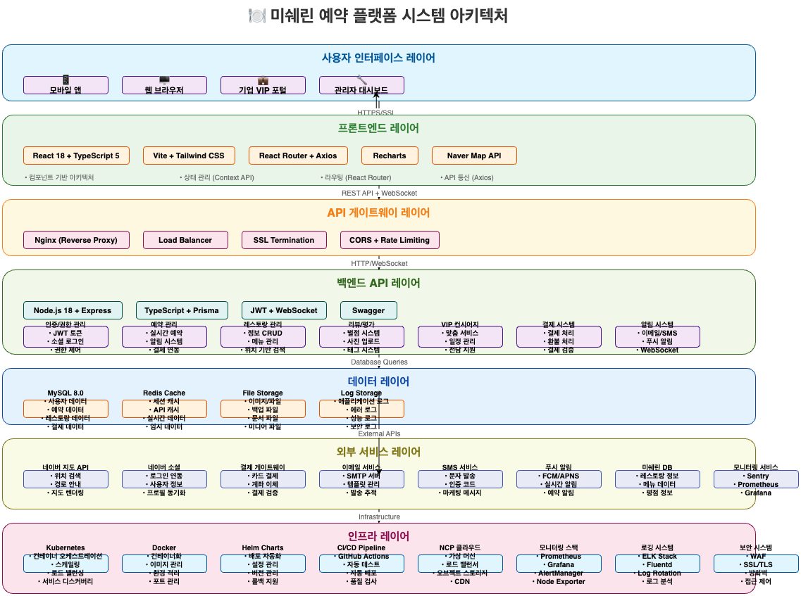

# 🏗️ 미쉐린 예약 플랫폼 시스템 아키텍처

## 📋 목차
1. [시스템 개요](#시스템-개요)
2. [아키텍처 다이어그램](#아키텍처-다이어그램)
3. [기술 스택](#기술-스택)
4. [인프라 구성](#인프라-구성)
5. [보안 아키텍처](#보안-아키텍처)
6. [확장성 전략](#확장성-전략)
7. [모니터링 & 로깅](#모니터링--로깅)

---

## 🎯 시스템 개요

### 비즈니스 도메인
- **B2C**: 일반 사용자 예약 플랫폼
- **B2B**: VIP/기업 컨시어지 서비스
- **B2B2C**: 레스토랑 관리자 대시보드

### 핵심 기능
- 미쉐린 레스토랑 예약 시스템
- VIP 컨시어지 서비스
- 리뷰 및 평점 시스템
- 실시간 알림 서비스
- 결제 연동 (확장 예정)

---

## 🏛️ 아키텍처 다이어그램


---

## 🛠️ 기술 스택

### Frontend
| 기술 | 버전 | 용도 |
|------|------|------|
| React | 18.x | UI 프레임워크 |
| TypeScript | 5.x | 타입 안정성 |
| Vite | 5.x | 빌드 도구 |
| Tailwind CSS | 3.x | 스타일링 |
| React Router | 6.x | 라우팅 |
| Axios | 1.x | HTTP 클라이언트 |

### Backend
| 기술 | 버전 | 용도 |
|------|------|------|
| Node.js | 18.x | 런타임 |
| Express.js | 4.x | 웹 프레임워크 |
| Sequelize | 6.x | ORM |
| JWT | 9.x | 인증 |
| Socket.io | 4.x | 실시간 통신 |
| Prisma | 5.x | DB 클라이언트 |

### Database & Cache
| 기술 | 버전 | 용도 |
|------|------|------|
| MariaDB | 10.x | 메인 데이터베이스 |
| Redis | 7.x | 세션/캐시 |
| Prisma | 5.x | DB 마이그레이션 |

### Infrastructure
| 기술 | 버전 | 용도 |
|------|------|------|
| Docker | 24.x | 컨테이너화 |
| Nginx | 1.24 | 리버스 프록시 |
| PM2 | 5.x | 프로세스 관리 |
| GitHub Actions | - | CI/CD |

### Monitoring
| 기술 | 버전 | 용도 |
|------|------|------|
| Prometheus | 2.x | 메트릭 수집 |
| Grafana | 10.x | 대시보드 |
| Loki | 2.x | 로그 수집 |
| Sentry | - | 에러 추적 |

---

## ☁️ 인프라 구성

### 개발 환경
```
Local Development
├── Frontend: localhost:5173
├── Backend: localhost:8000
├── Database: localhost:3306
└── Redis: localhost:6379
```

### 운영 환경
```
Production (NCP)
├── Load Balancer: Nginx
├── Frontend: Docker Container
├── Backend: Docker Container
├── Database: MariaDB (NAS)
├── Cache: Redis Container
└── Monitoring: Prometheus + Grafana
```

### 네트워크 구성
```
Internet
    ↓
[Domain/DNS]
    ↓
[Nginx Reverse Proxy]
    ↓
[Application Containers]
    ↓
[Database Layer]
```

---

## 🔒 보안 아키텍처

### 인증 & 인가
- **JWT 기반 인증**: Access Token + Refresh Token
- **Role-based Access Control**: 일반/VIP/관리자 권한 분리
- **OAuth 2.0**: 네이버 소셜 로그인 연동

### 데이터 보안
- **암호화**: 비밀번호 bcrypt 해싱
- **HTTPS**: SSL/TLS 암호화 통신
- **API 보안**: Rate Limiting, CORS 설정

### 인프라 보안
- **방화벽**: 포트 제한 및 IP 화이트리스트
- **백업**: 자동 백업 및 복구 시스템
- **모니터링**: 보안 이벤트 실시간 감시

---

## 📈 확장성 전략

### 수평 확장
- **로드 밸런싱**: Nginx를 통한 트래픽 분산
- **마이크로서비스**: 서비스별 독립적 확장
- **캐싱**: Redis를 통한 성능 최적화

### 데이터베이스 확장
- **읽기/쓰기 분리**: Master-Slave 구성
- **샤딩**: 데이터베이스 파티셔닝
- **인덱싱**: 쿼리 성능 최적화

### API 확장
- **버전 관리**: API 버전별 호환성 유지
- **문서화**: Swagger를 통한 자동 문서화
- **테스트**: 자동화된 API 테스트

---

## 📊 모니터링 & 로깅

### 메트릭 수집
- **시스템 메트릭**: CPU, 메모리, 디스크 사용량
- **애플리케이션 메트릭**: API 응답 시간, 에러율
- **비즈니스 메트릭**: 예약 수, 사용자 수, 매출

### 로깅 전략
- **구조화된 로깅**: JSON 형태의 로그 포맷
- **로그 레벨**: ERROR, WARN, INFO, DEBUG
- **로그 수집**: Loki를 통한 중앙화된 로그 관리

### 알림 시스템
- **임계값 알림**: 시스템 리소스 임계값 초과 시
- **에러 알림**: 애플리케이션 에러 발생 시
- **비즈니스 알림**: 예약, 결제 등 중요 이벤트 시

---

## 🚀 성능 최적화

### 프론트엔드 최적화
- **코드 스플리팅**: 라우트별 번들 분리
- **이미지 최적화**: WebP 포맷 및 lazy loading
- **캐싱**: 브라우저 캐싱 및 CDN 활용

### 백엔드 최적화
- **데이터베이스 쿼리 최적화**: 인덱스 및 쿼리 튜닝
- **캐싱 전략**: Redis를 통한 데이터 캐싱
- **비동기 처리**: Node.js 이벤트 루프 활용

### 인프라 최적화
- **컨테이너 최적화**: 멀티스테이지 빌드
- **네트워크 최적화**: CDN 및 압축 활용
- **리소스 관리**: 자동 스케일링 및 리소스 모니터링

---

## 📋 배포 전략

### CI/CD 파이프라인
```
Git Push
    ↓
GitHub Actions
    ↓
Build & Test
    ↓
Docker Image Build
    ↓
Deploy to Production
    ↓
Health Check
    ↓
Rollback (if needed)
```

### 환경별 배포
- **Development**: 로컬 개발 환경
- **Staging**: 테스트 환경 (운영과 동일)
- **Production**: 실제 서비스 환경

### 무중단 배포
- **Blue-Green Deployment**: 새 버전과 기존 버전 전환
- **Rollback Strategy**: 문제 발생 시 이전 버전으로 복구
- **Health Check**: 배포 후 서비스 상태 확인

---

## 🔮 향후 확장 계획

### 단기 계획 (3-6개월)
- [ ] 결제 시스템 연동
- [ ] 모바일 앱 개발
- [ ] 실시간 채팅 기능
- [ ] AI 추천 시스템

### 중기 계획 (6-12개월)
- [ ] 마이크로서비스 아키텍처 전환
- [ ] 다국어 지원
- [ ] 고급 분석 대시보드
- [ ] API 마켓플레이스

### 장기 계획 (1년 이상)
- [ ] 글로벌 확장
- [ ] 블록체인 기반 예약 시스템
- [ ] AR/VR 레스토랑 체험
- [ ] 자율주행 배송 연동

---

## 📊 🎨 시스템 아키텍처 다이어그램

<div align="center">

### 🏗️ **시스템 구조 Draw.io 다이어그램**

| 📋 파일명/경로                                 | 👁️ 미리보기/설명 |
|:---------------------------------------------:|:---------------:|
| `docs/drawio/system-architecture.drawio`      |  |

> 💡 **💻 편집 방법**: `.drawio` 파일을 [draw.io](https://app.diagrams.net/)에서 열어서 수정 가능합니다.

</div>

---

*이 문서는 프로젝트의 기술적 방향성을 정의하며, 개발팀과 이해관계자들이 시스템을 이해하고 의사결정을 내리는 데 활용됩니다.*